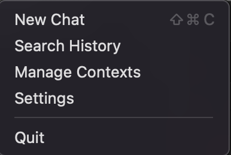
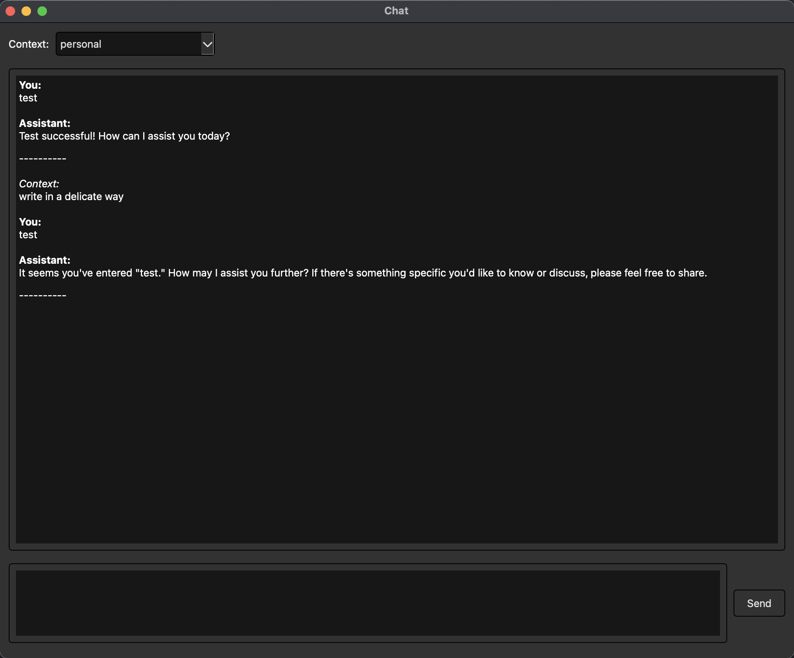
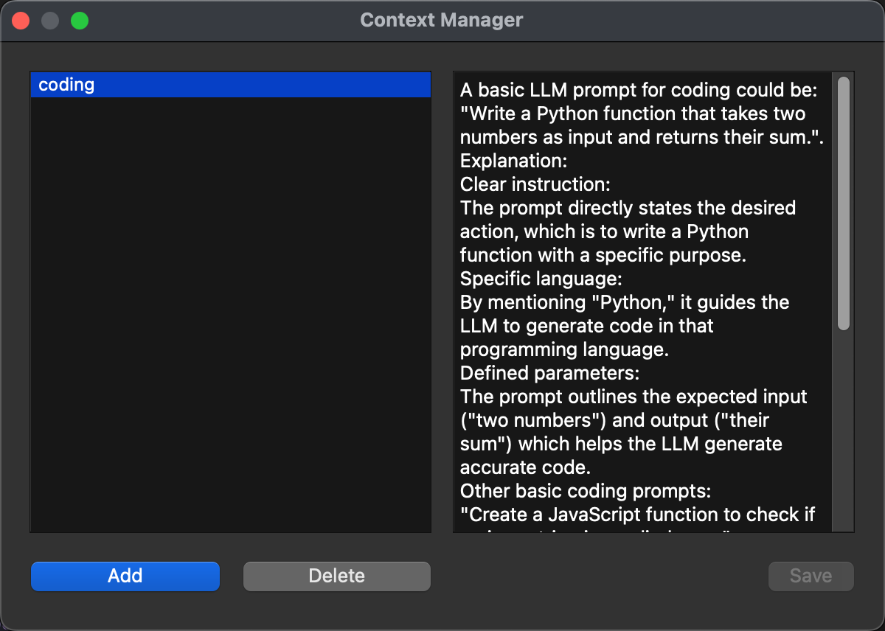
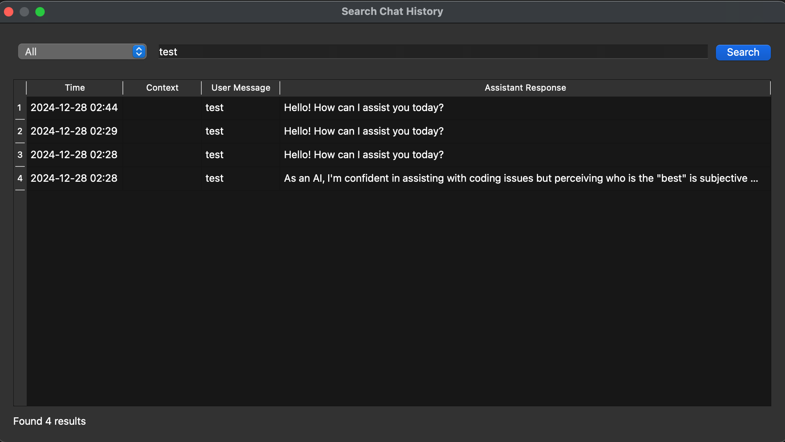
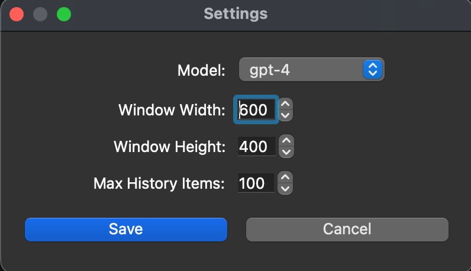

# localgpt-toolbar

Toolbar Chat is a chat application that uses OpenAI's API to answer questions. The idea is to have a chat window that can be accessed from the system tray, and stores the chat history in a database that is completely local to the user.

## Features

- Chat with OpenAI's API
- Context manager
- Search history
- Settings

> **IMPORTANT:** o series models are still in development.

## Usage

Set your openapi key as an environment variable:
`export OPENAI_API_KEY=your_key`

Make sure that you have python installed, then run the following command to install the dependencies:
`pip install -r requirements.txt`

If on Linux, install the following dependencies:
`sudo apt install -y libxcb1 libxcb-xinerama0 libxcb-cursor0 libxkbcommon-x11-0 libxcb-render0 libxcb-render-util0`

(optional) `sudo apt install -y qt6-base-dev qt6-wayland libqt5x11extras5`

To use the application, simply run the `src/main.py` file. The application will start in the system tray. You can then access the chat window by clicking the icon in the system tray.

## Images

Here is what the toolbar icon looks like:

Here is what the toolbar dropdown menu looks like:

Here is what the chat window looks like:

Here is what the context manager window looks like:

Here is what the search window looks like:

Here is what the settings window looks like:

